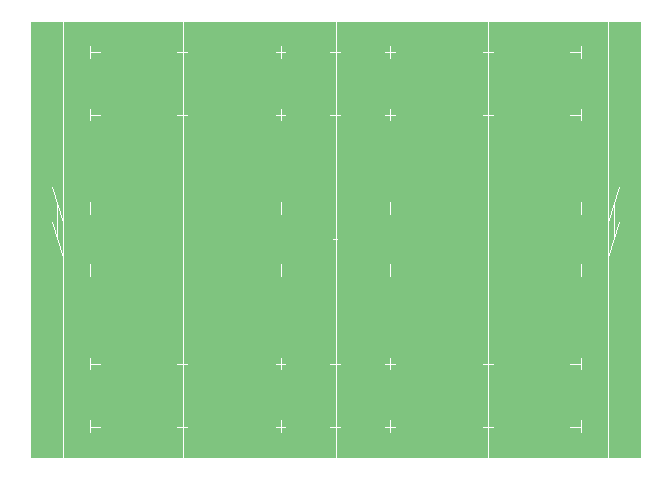

ggrugby
=======

Code based on [ggsoccer](https://github.com/Torvaney/ggsoccer)

Overview
--------

*ggrugby* provides functions for plotting rugby events in {ggplot2}

Installation
------------

    # install.packages("remotes")
    remotes::install_github("javiereliomedina/ggrugby")

Usage
-----

    library(ggplot2)
    library(ggrugby)

    ggplot() +
      rugby_pitch() +
      theme_void() 
    #> Warning: Ignoring unknown parameters: fill

    #> Warning: Ignoring unknown parameters: fill

<!-- -->
